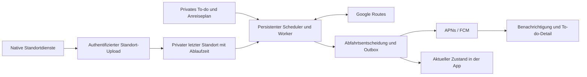

# Native Cronicl-App und adaptive Anreisebegleitung

Stand: 2026-09-08. Status: **Recherche und Entscheidungsvorschlag, nicht freigegebene Implementierungsspezifikation**.

## Auftrag und Grenzen

Ziel: Eine für den bestehenden Code geeignete iOS-/Android-Architektur für Standortaktualisierung, Verkehrsprüfung im Hintergrund und eine verständliche Anreiseoberfläche empfehlen. Drei begrenzte Rechercheaufträge mit GPT-5.6 Luna; Zusammenführung und Repository-Abgleich durch den Hauptagenten.

In Scope: Recherche, Architekturvergleich, UI-Konzept, Umsetzungspakete und deren Akzeptanzkriterien. Schreibbereich und alleiniger Konfliktdomain: dieses Recherche-Dokument unter `docs/plans/`. Außerhalb: Produktionscode, freigegebene Spezifikationen, Migrationen, API-Vertrag, Infrastrukturänderungen, Deployment und externe Schreibaktionen. Erlaubte Nebenwirkung: lokales Recherche-Dokument. Abnahme: belegte Empfehlung, nachvollziehbare Plattformgrenzen und konkrete nächste Arbeitspakete. Stopbedingungen für spätere Implementierung: ungeklärte normative Konflikte, fehlende Gerätevalidierung oder nicht tragfähiger nativer Auth-/Standortpfad.

Annahme bis zur Produktentscheidung: beide mobilen Plattformen berücksichtigen; Standortbegleitung gezielt rund um private Anreisen, kein ganztägiger Bewegungsverlauf. Die erste Geräteplattform ist noch offen.

## Empfehlung

**Bestehende Svelte-Oberfläche mit Capacitor als installierbare App ausliefern, native Standortdienste ergänzen und Verkehrsüberwachung in einem unabhängigen Backend-Worker ausführen.** Die endgültige Wahl des Standort-Plugins hängt von einem Test auf echten Geräten ab. Web bleibt ein gleichberechtigter Zugang mit sichtbar eingeschränkter Hintergrundfunktion.

| Alternative | Passung zu Cronicl | Entscheidung |
| --- | --- | --- |
| PWA mit Server-Worker und Web Push | Wenig Umbau; ein bestätigter fester Startort lässt sich serverseitig überwachen. Liefert keinen verlässlich fortlaufenden Browser-Standort bei geschlossener App. | Sinnvoller Fallback, erfüllt den gesamten Wunsch nicht. |
| Capacitor und Svelte | Wiederverwendung der Oberfläche, nativer Zugriff über Plugins; native Builds und Plattformpflege bleiben notwendig. | Bevorzugter erster Machbarkeitsnachweis. |
| React Native / Expo | Andere UI-Laufzeit; Svelte-Komponenten müssten weitgehend neu gebaut werden. Plattformbeschränkungen verschwinden dadurch nicht. | Rückfalloption bei grundlegenden Integrationsproblemen, kein begründeter sofortiger Rewrite. |
| SwiftUI und Kotlin/Compose | Größter direkter Plattformzugriff; zwei zusätzliche UI-Implementierungen. | Für den aktuellen Umfang hoher Aufwand. |

Das offizielle Capacitor-Geolocation-Plugin unterstützt Hintergrund-Geolocation nicht direkt. Ein nativer Hintergrundpfad muss ausdrücklich ergänzt und geprüft werden. [Capacitor Geolocation](https://capacitorjs.com/docs/apis/geolocation)

Capacitor stellt native Integrationen für Web-Oberflächen bereit; Expo dokumentiert ebenfalls Grenzen für Standortereignisse nach App-Beendigung. Der Aufwandvergleich oben ist eine Einschätzung anhand unseres Svelte-Bestands, kein gemessener Benchmark. [Capacitor](https://capacitorjs.com/docs), [Expo Location](https://docs.expo.dev/versions/latest/sdk/location/)

Für den Geräte-PoC zwei konkrete Kandidaten vergleichen: [Community Background Geolocation](https://github.com/capacitor-community/background-geolocation) und [Transistorsoft Background Geolocation](https://github.com/transistorsoft/capacitor-background-geolocation). Letzteres dokumentiert bewegungsabhängige Ortung; laut aktuell abgerufener README braucht die angebotene v9 für Release-Builds auf beiden Plattformen eine Lizenz. Keine Aussage zur Überlegenheit ohne Geräteprüfung. Entscheidungskriterien: kompatible Version, aktiver Wartungspfad, nativer Upload bei pausierter WebView, sichere Auth-Erneuerung, begrenzte Offline-Queue, nachweisbarer Stopp/Löschung und Release-Lizenz. Ein eigenes kleines Swift-/Kotlin-Modul ist die dritte Option, wenn Plugin-Verhalten oder Lizenz nicht passen; seine Wartung nicht unterschätzen.

## Was bereits vorhanden ist

- `frontend/src/routes/+layout.ts`: `ssr = false`, `prerender = true`; die Oberfläche ist bereits clientseitig. `frontend/svelte.config.js` verwendet trotzdem `adapter-node`. Für ein lokales App-Bundle einen separaten statischen Build samt Deep-Link-Fallback nachweisen.
- `frontend/src/lib/components/TodoDetailsSheet.svelte`: bestätigter Ort, Verkehrsmittel und ausdrücklich als Aktualisierung bei geöffneter App beschriftete Überwachung.
- `frontend/src/lib/components/UnifiedDay.svelte`: Anreise-Metazeile, nächste Aufgabe, Navigationslink, Browser-Geolocation und Fünf-Minuten-Intervall bei sichtbarem Dokument.
- `backend/app/routes/todo_planning.py`: Google Places/Routes; bei Auto `TRAFFIC_AWARE` und `departureTime = now`. Für spätere Termine ist das keine gezielte Prognose zur geplanten Abfahrt. Fachlogik liegt noch direkt im Handler.
- `frontend/src/lib/auth.ts`: Browser-Redirect für Google-Anmeldung, relative API-Adresse beziehungsweise `localhost:8000`; Backend-Sitzung per HttpOnly-Cookie. Nicht unverändert als nativer Login-/Uploadpfad nutzbar.
- `frontend/static/sw.js`: Offline-Caching, keine Push-Ereignisbehandlung. API-Cache verwendet einen gemeinsamen Namen; Kontowechsel/Offline-Wiederherstellung ausdrücklich testen, bevor neue sensible Daten in Caches gelangen. Dies ist ein Prüfpunkt aus Quellcodeinspektion, kein hier reproduzierter Sicherheitsbefund.

## Architektur und Produktverhalten

### Standort und Hintergrundbetrieb

Zwei getrennte Funktionen: **Verkehr am bestätigten Startort beobachten** und **Startort mit dem Smartphone aktualisieren**. Eine Verkehrsänderung kann der Server auch ohne frischen GPS-Fix erkennen; er darf eine alte Position jedoch nicht als aktuelle ausgeben. Die erste Funktion ist ein brauchbarer Modus bei verweigertem Standortzugriff.

Vorschlag: Nutzer aktiviert die Begleitung sichtbar. Während der Anreise wird nur der letzte erforderliche Fix mit Messzeit, Genauigkeit, Gerätebezug und Ablaufzeit vorgehalten. Kein Standortverlauf; keine Koordinaten in normalen Logs, KI-Eingaben, Push-Payloads oder Space-Antworten. Bei Ende, Widerruf oder Logout Upload und lokale Upload-Warteschlange stoppen sowie serverseitige Daten entsprechend der festzulegenden Löschregel entfernen. Mehrere Geräte dürfen sich nicht gegenseitig als Standortquelle überschreiben: ein ausgewähltes Begleitgerät pro aktiver Sitzung.

Ein termingesteuerter Beginn bei bereits geschlossener App ist eine eigene technische Hürde. Für den ersten Schnitt eine vom Nutzer gestartete Sitzung vorsehen; späteren automatischen Beginn nur nach separatem Plattformnachweis versprechen. iOS und Android begrenzen Hintergrundausführung und Standortzugriff. Sperrbildschirm, Suspendierung, Betriebssystem-Beendigung und ausdrücklich vom Nutzer erzwungenes Beenden sind unterschiedliche Testfälle. Keine sekundengenaue Dauerverfügbarkeit zusagen. [Apple Background Location](https://developer.apple.com/documentation/corelocation/handling-location-updates-in-the-background), [Android Background Location](https://developer.android.com/develop/sensors-and-location/location/background)

Auf Android ist für laufende Standortbegleitung ein korrekt deklarierter Location-Foreground-Service mit sichtbarer Systembenachrichtigung einzuplanen; sein Start unterliegt Hintergrund- und Berechtigungsgrenzen. Auf iOS die erforderlichen Core-Location-Fähigkeiten und den passenden Autorisierungsumfang testen. Push-Plugin und JavaScript-Listener sind kein Ersatz für diesen nativen Lebenszyklus. [Android Service Types](https://developer.android.com/develop/background-work/services/fgs/service-types), [Capacitor Push](https://capacitorjs.com/docs/apis/push-notifications)

### Worker und Abfahrtsentscheidung

Für den Haushaltsumfang zunächst separater Worker-Prozess mit persistenten Jobs, Leasing und eindeutigen Job-Schlüsseln in der bestehenden Datenbank; zusätzliche Queue-Infrastruktur erst bei begründetem Bedarf. Keine FastAPI-Request-Background-Task als dauerhafter Scheduler. Geschäftsfunktionen in Backend-Services auslagern.

Serverseitig gespeicherte Job-Zuordnung bestimmt das Konto. Vor Berechnung und Versand erneut prüfen: Konto/Gerät gültig, To-do privat und offen, Überwachung aktiv, Version des Termins unverändert. Terminänderung, Erledigen und Löschen machen alte Jobs und Nachrichten ungültig. Outbox, begrenzte Wiederholungen und Deduplizierung verhindern Mehrfachversand nach Worker-Neustarts.

Abfahrt = Terminbeginn − Ankunftspuffer − prognostizierte Reisezeit. Bei Auto muss die Prognose auf eine geeignete zukünftige Abfahrt bezogen werden; für eine gewünschte Ankunftsfrist sind begrenzte iterative Schätzungen mit konservativem Fallback ein Implementierungsvorschlag. `arrivalTime` wird laut Google außerhalb `TRANSIT` ignoriert. ÖPNV braucht die tatsächlichen Verbindungszeiten; eine Zeitspanne allein erfasst Warte-/Taktzeiten nicht zuverlässig. Nicht alle Verkehrsmittel als „Live-Verkehr“ ausweisen. [Google computeRoutes](https://developers.google.com/maps/documentation/routes/reference/rest/v2/TopLevel/computeRoutes)

Startwerte zur späteren Messung, keine garantierten Takte: weit vor der Abfahrt selten prüfen; im relevanten Zeitfenster etwa alle 5–15 Minuten; kurz vor Abfahrt etwa alle 2–5 Minuten; relevante Ortsänderungen zusätzlich entprellt berücksichtigen. Zeitfenster an geschätzter Abfahrt orientieren, damit längere Fahrten nicht zu spät überwacht werden. Aktualität des Standorts, Route und Gerätestatus getrennt bewerten.

Push bei „jetzt los“, drohender Verspätung oder wesentlicher Verschiebung, beispielsweise fünf Minuten. Schwellenwert, Ruhezeit und Hysterese verhindern Hin-und-her-Meldungen. Nachricht mit Ablaufzeit und ersetzbarer Kennung versenden; beim Öffnen aktuellen Zustand und Berechtigung neu laden. Keine Zusage von Exactly-once-Zustellung oder exakter Zustellzeit. Stille Push-Nachrichten sind kein verlässlicher Wecker für regelmäßige GPS-Abfragen. [FCM Message Lifespan](https://firebase.google.com/docs/cloud-messaging/customize-messages/setting-message-lifespan), [Apple Background Notifications](https://developer.apple.com/documentation/usernotifications/pushing-background-updates-to-your-app)

### Native Anmeldung

Google-Anmeldung über den vorgesehenen nativen beziehungsweise Systembrowser-Flow, mit passenden Client-IDs und gesichertem Rücksprung. Kein Google-Login in unserer eingebetteten WebView. Kontozuordnung weiterhin ausschließlich serverseitig nach verifiziertem Login. Native Sitzung und authentifizierter Hintergrund-Upload benötigen einen überprüften Entwurf einschließlich Widerruf, sicherer Speicherung und Kontowechsel; bestehende Browser-Cookies nicht als automatisch übertragbar voraussetzen. [Google OAuth Policies](https://developers.google.com/identity/protocols/oauth2/policies), [OAuth for Native Apps](https://www.rfc-editor.org/info/rfc8252/)

### Kosten und Providergrenzen

Google Routes zunächst beibehalten, weil Places-IDs und Integration bereits bestehen. Compute Routes wird pro Anfrage abgerechnet; ein Wechsel zur Matrix bedeutet Abrechnung je Origin-/Destination-Element und ist nicht automatisch günstiger. Traffic-Funktionen beeinflussen die SKU. [Routes Usage and Billing](https://developers.google.com/maps/documentation/routes/usage-and-billing)

Illustrative Kapazität, keine Nutzungsprognose: 20 Konten × 2 Anreisen/Tag × 8 Prüfungen + 80 manuelle Prüfungen = 400 Prüfungen/Tag. Bei durchschnittlich 1–2 Provideraufrufen je Prüfung ungefähr 12.000–24.000 Aufrufe pro 30 Tage, vor Retries. Abrechnung anhand aktueller SKU, Freikontingente und Preisstaffeln; dazu Places, Hosting und gegebenenfalls Plugin-/Entwicklerkonto-Lizenzen. Im Worker ein hartes Anfragelimit und Backoff umsetzen; Budgetbenachrichtigungen allein sind kein Kostendeckel.

Eigene Standortdaten und Google-Inhalte getrennt behandeln. Keine unbegrenzte Historie von Providerantworten planen. Welche Ergebnisse wie lange zwischengespeichert und wie attribuiert werden dürfen, vor Produktionsumsetzung anhand des tatsächlich geltenden Vertrags und der Region klären; eine frei gewählte kurze TTL ist allein keine Nutzungserlaubnis. [Aktuelle Maps Service Terms](https://cloud.google.com/maps-platform/terms/maps-service-terms), [Places Policies](https://developers.google.com/maps/documentation/places/web-service/policies)

## UI-Konzept

### Vergleichbare Muster und Übertragung

| Quelle | Übertragbares Muster | Nutzen und Grenze |
| --- | --- | --- |
| [Apple Calendar](https://support.apple.com/en-gb/guide/calendar/icl43600/mac) | Zielort und Termin mit Losgeh-Hinweisen verbinden | Anreise wird Teil des Termins; die dokumentierte Mac-/Apple-Integration ist keine Garantie für unsere App. |
| [Waze Planned Drives](https://support.google.com/waze/answer/6378906?co=GENIE.Platform%3DAndroid&hl=en) | Gewünschte Ankunft speichern, verkehrsabhängig an Abfahrt erinnern | Klare Aufgabe; aktueller Standort erfordert passende Erlaubnis. |
| [Google Maps Fahrtplanung](https://support.google.com/maps/answer/7565193?co=GENIE.Platform%3DAndroid&hl=en) | Verkehrsmittel und zeitabhängige Route zusammen betrachten | Gut im Anreisedetail; eine Karte als Hauptansicht passt weniger zum gemischten Tagesablauf. |
| [Apple Location Authorization](https://developer.apple.com/documentation/corelocation/requesting-authorization-to-use-location-services) | Zugriff im Zusammenhang mit der Funktion anfordern | Verständlicher Opt-in; Betriebssystemdialoge können nicht beliebig gestaltet werden. |
| [WCAG 2.2 Target Size](https://www.w3.org/WAI/WCAG22/Understanding/target-size-minimum.html) | Ausreichende Zielgröße beziehungsweise Abstände | Mindestanforderungen mit Ausnahmen; für zentrale Touch-Aktionen größere Ziele anstreben. |

Vergleich: Feed mit einer nächsten Handlung gewinnt für Cronicl bei Tageskontext, Dichte, vorhandener Komponentenbasis und zugänglicher Listenbedienung. Karte zuerst gewinnt bei räumlicher Orientierung, erhöht aber Platzbedarf und Implementierungsumfang. Diese Bewertung ist eine Designhypothese für einen späteren Alltagstest, kein durch die Quellen bewiesenes Usability-Ergebnis.

Den bestehenden ruhigen Tagesablauf weiterentwickeln: oben höchstens eine nächste Handlung, darunter kompakte Aufgaben. Karte erst im Anreisedetail, Navigation über eine vorhandene Navigations-App. Warme Flächen, semantische Tokens, eindeutige Typografie und zurückhaltende Statusfarben beibehalten.

Beispiel für die hervorgehobene Handlung, mit rein illustrativen Daten:

> **Um 17:12 losfahren**  
> Termin · 18:00 · bestätigter Zielort  
> 38 Min. Fahrt + 10 Min. Puffer  
> Wegen Verkehr 8 Min. früher · geprüft vor 1 Min.  
> **Navigation öffnen** · Anreise ansehen

„Wegen Verkehr“ nur verwenden, wenn diese Ursache belegbar ist. Bei geändertem Startort entsprechend „Abfahrt nach Standortaktualisierung angepasst“. Countdown ergänzt die absolute Uhrzeit. „Navigation öffnen“ bedeutet nicht automatisch „Fahrt begonnen“; Begleitung separat nachvollziehbar starten/stoppen.

Im To-do-Detail: Termin und Ziel, Verkehrsmittel, Puffer, Startortmodus, Begleitung und Benachrichtigungen; darunter Zeitlinie aus Abfahrt, Ankunft und Termin sowie getrennte Prüfzeiten. Eine sichtbare Pause-/Beenden-Aktion und Gerätestatus gehören dazu. Berechtigungen erst bei Nutzung erklären und anfordern, nicht gesammelt beim ersten App-Start.

| Zustand | Darstellung | Sichtbare Handlung |
| --- | --- | --- |
| Nicht eingerichtet | „Anreise planen“ | Ort, Zeit und Verkehrsmittel ergänzen |
| Geplant, noch nicht begleitet | Abfahrtsprognose mit Quelle und Prüfzeit | „Begleitung starten“ |
| Aktiv, Daten aktuell | „Abfahrt 17:12 · 38 Min.“ | Anreise ansehen / pausieren |
| Relevante Änderung | Alte/neue Abfahrtszeit und belegbarer Grund | Details / Navigation |
| Jetzt los | Eine hervorgehobene nächste Handlung | Navigation öffnen |
| Standort alt/ungenau | „Standort vor 24 Min.; Prognose eingeschränkt“ | Standort aktualisieren / Startort wählen |
| Push verweigert | „Updates nur in der App sichtbar“ | Systemeinstellungen öffnen |
| Offline / Anbieterfehler | Letzte Prognose mit Prüfzeit, keine Live-Kennzeichnung | Erneut prüfen |
| Pausiert / beendet | Eindeutiger Status ohne Countdown | Fortsetzen, sofern weiterhin sinnvoll |

Wiederverwenden: `UnifiedDay`, `TodoDetailsSheet`, `UiSurface`, `UiButton`, `UiIconButton`, bestehende Tokens. Gezielt ergänzen: Anreise-Zustandsmodell, `TravelStatus`, `TravelDetail`, `TravelPermissionExplanation`; Namen sind Vorschläge. Kein neues allgemeines UI-Framework erforderlich. Auf Desktop kann dasselbe Detail als Seitenpanel erscheinen, mobil als vorhandener Sheet-/Dialogfluss. Fokus setzen/zurückgeben, Textvergrößerung, Touch-Ziele und reduzierte Bewegung prüfen; Aktualisierungen nicht sekündlich über Screenreader ausgeben.

## Umsetzung in überprüfbaren Paketen

1. **Produkt-/Spec-Revision:** private Begleitsitzung, Erlaubnisse, Speicherung/Löschung, Aktualitätsgrenzen, Push-Regeln und Unterstützungsversprechen festlegen. Keine Migration im selben Entscheidungsschritt.
2. **Nativer Machbarkeitsnachweis:** separater App-Build; echter Google-Login; ein authentifizierter nativer Standort-Upload bei gesperrtem Gerät; sichtbarer Push mit Deep Link; Widerruf/Logout. Geräteprotokoll und Akkuvergleich statt Emulator-only-Abnahme. Plugin-Auswahl danach festziehen.
3. **Backend mit festem Startort:** Travel-Service, persistenter Worker, begrenzte Routenabfragen, Outbox und Push. Mit zwei Konten, Neustart, Doppeljob, Terminänderung und abgelaufener Nachricht testen. Ein sauberer Modus ohne Standortberechtigung ist damit schon nutzbar.
4. **Native Begleitung:** kurzlebiger letzter Fix, ausgewähltes Gerät, Offline-Verhalten, Ablauf und Löschung; keine verzögerten alten Fixes als aktuellen Standort übernehmen.
5. **UI und Alltagstest:** gemeinsames Zustandsmodell, Hervorhebung, Detail, Berechtigungsfluss, Notification-Rücksprung. Gesperrtes Gerät, schwaches Netz, Energiesparen, Berechtigungsentzug, Force-stop und nächster App-Start auf iPhone und Android dokumentieren. Frontend: `npm run check`, `npm run lint:design`, `npm run build`; Backend: einschlägige Isolation-/Travel-/Worker-Tests und `pytest -q`.

Beim späteren Implementieren jedes Paket mit eigenem Scope und Konfliktdomain eröffnen. Auth, gemeinsame API/Types, OpenAPI und Alembic strikt serialisieren. Kein belastbarer Gesamtzeitplan vor dem Geräte-PoC; dort liegen die wesentlichen Unbekannten.

## Artefaktprüfung

Nach `fittrack-artifact-lifecycle`, anhand Registry, Specs und obiger Codepfade:

| Artefakt | Bewertung für die vorgeschlagene Umsetzung |
| --- | --- |
| `docs/specs/todo-places-and-travel.md` | **revise**: neuer nativer Standort-/Speicherpfad, Worker und Benachrichtigungen erweitern ausdrücklich die bisherige Betriebsgrenze. Bestehende Spezifikation bleibt bis zur Revision maßgeblich. |
| `docs/specs/shared-spaces.md` | Privatsphäregrenze wird beibehalten: Standort-/Anreise-Checks bleiben privat. Gemeinsame To-dos mit privater Begleitung wären ein gesonderter späterer Revisionsauftrag. |
| Account-/Session-Spezifikation | Bei nativem Login **revise** beziehungsweise explizit ergänzen; Serveridentität und Kontentrennung bleiben zwingend. Vor Auth-Implementierung vollständig lesen und Tests zuordnen. |
| `docs/design/cronicl-day-feed-interaction.md` | Vor Implementierung **revise** um Anreise-Zustände, Berechtigungsfluss und Notification-Einstieg; bestehender gemischter Feed bleibt erhalten. |
| `docs/design/cronicl-ui-direction.md` | Kein Richtungswechsel vorgeschlagen. Vorhandene visuelle Vorgaben sind mit diesem Konzept vereinbar; noch keine visuelle Geräteabnahme. |

Keine freigegebene Spec oder Registry wurde in dieser Recherche geändert. Es wurden keine App-Tests ausgeführt, da nur Recherche dokumentiert wird; die genannten Abnahmen sind zukünftige Verpflichtungen, keine erledigten Checks.

## Recherche-Delegation und wiederverwendbare Prompts

Eingesetzt: drei Subagents mit **GPT-5.6 Luna, reasoning high**, jeweils ohne geerbte Vollhistorie, mit gezielten Dateipfaden und Produktkontext. Das begrenzt Kontextkosten und doppelte Arbeit. Jeder Auftrag verlangte Primärquellen, ein kurzes deutsches Ergebnis, ein erstes Quellen-Checkpoint, eine Obergrenze von acht Minuten und keinerlei Dateiänderungen. Die Ergebnisse wurden gegen den Code und entscheidende Originalquellen geprüft. Kein Subagent hat Architektur- oder Freigabeautorität.

Die folgenden kompakten Fassungen halten die Aufgaben für weitere Recherchen reproduzierbar:

**Plattformen:** „Recherchiere für Cronicl (Svelte 5/SvelteKit, FastAPI, private Haushaltsdaten) native iOS-/Android-Anreisebegleitung. Vergleiche Capacitor, React Native/Expo und native UIs anhand Wiederverwendung, Background Location, Force-quit/Reboot, Akku, Berechtigungen, Push und Plugin-Lizenz. Beachte statischen App-Build und Systembrowser-OAuth. Nutze offizielle Quellen; trenne dokumentiertes Verhalten, Best Effort und Unbekanntes. Keine Implementierung. Liefere maximal 1.000 deutsche Wörter, 6–9 direkte Quellen, Empfehlung und Geräte-PoC-Gates; erstes Checkpoint nach drei Quellen, Abschluss binnen acht Minuten.“

**Backend:** „Lies die Travel-Spec und `todo_planning.py`, niemals Geheimnisse. Recherchiere Google Routes für zeitabhängige Anreise, Drive versus Transit, Abrechnung und Speicherbedingungen. Entwirf getrennte Standort- und Worker-Pfade mit Aktualität, Widerruf, privaten Konten, Job-Versionierung und deduplizierten Pushs. Kennzeichne die erforderliche Spec-Revision; Space-Tracking ist ausgeschlossen. Liefere maximal 1.000 deutsche Wörter, 5–8 Primärquellen, konkrete Code-Lücken und eine Kostenformel mit Annahmen. Keine Dateien ändern; Abschluss binnen acht Minuten.“

**UI:** „Lies Designrichtung, Interaktionsvertrag, Travel-Spec und die bestehenden Komponenten. Vergleiche Feed plus nächste Handlung mit Karte zuerst für native Anreise-Updates. Recherchiere zwei reale Produkte und offizielle Accessibility-/Komponentenquellen. Liefere maximal 1.000 deutsche Wörter mit fünf direkten Quellen, übertragbaren Mustern und Grenzen, Zustandsmatrix, Berechtigungs-/Deep-Link-Fluss, wiederverwendbaren Komponenten und kleinem ersten Arbeitspaket. Kein allgemeiner Redesign-Ausflug, keine Dateien ändern; Abschluss binnen acht Minuten.“

Synthese-Korrekturen: die vom UI-Agenten vorgeschlagene PWA-Zwischenstufe ist nur ein optionaler früher Schnitt, nicht das native Zielbild. Die Plugin-Wahl bleibt offen. Eine vom Backend-Agenten gefundene archivierte Fassung der Providerbedingungen wurde nicht als aktuelle Vertragsgrundlage übernommen. Die angefragte Ergebnisstruktur wurde somit zur Evidenzgewinnung genutzt, nicht ungeprüft als Produktentscheidung kopiert.
